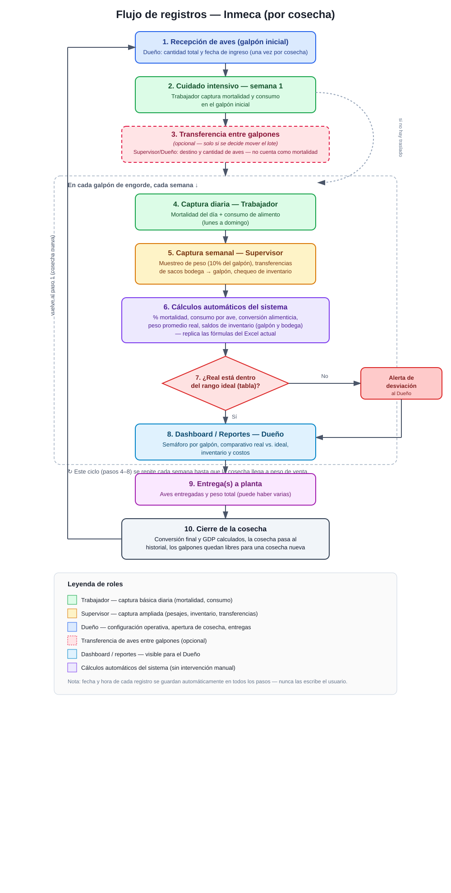

# Plan MVP/POC — App de Registro de Producción Avícola (Inmeca)

## 1. Contexto y alcance

La operación de Inmeca consiste únicamente en el **engorde de aves**: se reciben las aves en un galpón inicial, se registran consumo de alimento, mortalidad y muestreos de peso durante todo el proceso (aprox. 6-7 semanas), y al final se entregan en pie a la planta. No hay procesamiento (matanza, limpieza, empaque) dentro del alcance de la app.

El prototipo (POC) es **mobile-first** y usa datos de ejemplo reales, pensado para que el dueño vea y valide el flujo de trabajo antes de invertir en la versión final. La interfaz debe ser lo más simple posible: quienes la usan a diario (trabajador, supervisor) no son personas técnicas, así que cada pantalla debe pedir el mínimo de datos posible (ver sección 4). Al mismo tiempo, esta es una aplicación pensada para un sistema de producción real, que gestiona cosechas de valor alto (millones de lempiras) — el diseño y el tono deben sentirse profesionales y confiables, como un sistema de gestión empresarial, y no como una app casera, aunque se trate solo de un POC.

## 2. Entidades y terminología

Se usan tres términos consistentes en toda la app:

- **Granja**: la operación completa, contiene uno o varios **Galpones**.
- **Galpón**: instalación física donde viven las aves. Puede estar vacío (disponible) u ocupado por una cosecha activa.
- **Cosecha** (equivalente a lo que hoy se maneja como "ciclo" o "lote"): es el conjunto de aves que entra junto a la granja en una fecha determinada y se sigue hasta que se entrega por completo a la planta. Una cosecha puede pasar por más de un galpón durante su vida (ver sección 5, transferencia entre galpones).

Esto reemplaza el patrón actual de "una hoja de Excel por semana/cosecha" por un modelo donde cada galpón tiene una cosecha activa (o está vacío) y un historial de cosechas anteriores.

## 3. Roles y permisos

Se manejan cuatro tipos de usuario. Los primeros tres son roles **operativos** (todo lo relacionado con el día a día de la granja); el cuarto es un rol **técnico/de plataforma**, separado del negocio.

**Trabajador / galponero (registrar datos es su responsabilidad principal):**
- Login simple, ve solo el/los galpones que tiene asignados. Al entrar, cae directo en la pantalla de registro — es su acción central, no un paso más detrás de un menú.
- Captura mortalidad y consumo diario. Además, como su función real en el día a día también incluye mantenimiento (limpieza, revisión del galpón), ve una lista simple de **tareas asignadas** (ver sección 13), que marca como hechas, y puede **solicitar permisos**.
- Solo puede **ingresar** información y, como consecuencia, ver **lo que él mismo acaba de registrar** — un historial personal simple, no un dashboard.
- No ve comparativos real vs. ideal, semáforos, costos, alertas, ni información de otros galpones o de otras personas. Cero reportes: su pantalla es de acción, no de análisis.

**Supervisor (dirige la operación física de la granja):**
- Ve con claridad los registros de todos los trabajadores a su cargo (quién registró hoy y quién no), y puede ingresar mortalidad y consumo en su lugar si no pudieron hacerlo.
- Gestiona a los trabajadores: asignación a galpones, y **asigna y calendariza directamente las tareas de mantenimiento** de su equipo (no solo las ve).
- Maneja todo lo operativo del ciclo activo: pesajes/muestreos, transferencias de aves entre galpones (opcional), ingresos y transferencias de inventario de alimento, chequeos de inventario y bodega — porque es quien dirige la operación físicamente dentro de la granja.
- Ve las solicitudes de permiso de su equipo, pero no las aprueba — eso es del Dueño.
- No tiene acceso al historial de cosechas cerradas ni a costos, para no sobrecargar su pantalla con información que no necesita para operar el día a día.

**Dueño (control y toma de decisiones):**
- Al entrar, ve de inmediato un resumen con el estado general de la granja — un insight claro, no un menú que tenga que interpretar.
- Puede ejecutar cualquier acción de Trabajador o Supervisor si lo necesita, pero su función principal es de manejo y control: revisar historiales, comparar cosechas, y decidir — no la operación diaria en sí.
- Tiene todos los privilegios: configuración de la granja (galpones, apertura de cosechas, usuarios operativos), dashboard, reportes, historial de cosechas cerradas y entregas a planta.
- Además, es quien **calendariza** las tareas de mantenimiento y turnos de los trabajadores (junto con el Supervisor), y quien **aprueba o rechaza las solicitudes de permiso** que estos envían (ver sección 13).
- Es el usuario del negocio — no gestiona nada técnico de la aplicación en sí.

**Admin (plataforma/soporte técnico):**
- Es la cuenta de mantenimiento de la aplicación, para uso interno (no del cliente/dueño).
- Cubre todo lo que **no** es operación de la granja: configuración técnica del sistema, altas/bajas de granjas a nivel plataforma, soporte y mantenimiento, ajustes de la tabla técnica de valores ideales cuando se habilite como módulo administrable, y cualquier tarea de infraestructura de la app.
- No participa en el flujo diario de la granja (no captura mortalidad, consumo, etc.) — su función es mantener la aplicación funcionando, no operarla.

En resumen, hay tres niveles de visibilidad claramente escalonados: el Trabajador solo actúa (registra y marca tareas) y ve nada más lo suyo; el Supervisor ve y opera todo lo del ciclo activo; el Dueño ve todo — operación, historial y personal. El Admin queda aparte, como una pantalla técnica que no ve ni el cliente ni el resto del equipo.

## 4. Principio de captura mínima (aplica a toda la app)

Como quienes registran datos no son personas técnicas, la regla general en todas las pantallas es: **el trabajador/supervisor solo escribe el dato que nadie más puede saber** (cuántas aves murieron hoy, cuántos sacos entraron, cuánto pesó la muestra). Todo lo demás se captura solo automáticamente, sin que la persona tenga que llenarlo:

- **Fecha y hora del registro**: se guardan automáticamente en segundo plano cada vez que alguien registra algo — nunca se le pide al usuario que las escriba a mano.
- **Usuario que hizo el registro**: queda asociado automáticamente por el login, para trazabilidad.
- **Cálculos derivados** (acumulados, porcentajes, comparaciones contra tabla, saldos de inventario): siempre calculados por el sistema, nunca ingresados a mano.
- **Formularios cortos y de opción múltiple donde se pueda** (por ejemplo, elegir el galpón de una lista en vez de escribirlo, o el tipo de alimento de un selector), para minimizar cuánto hay que escribir desde un celular.

## 5. Recepción y transferencia de aves entre galpones (transferencia opcional)

Cada registro de aves vive dentro de un galpón. En algunos casos las aves se reciben directamente en el galpón donde van a quedarse todo el ciclo, sin ningún movimiento posterior. En otros casos, sobre todo en las primeras semanas, se maneja un periodo de recepción/cuidado intensivo en un único galpón y luego se transfieren hacia uno o varios galpones donde terminan el engorde. La app tiene que soportar **ambos casos con la misma naturalidad**, sin forzar un paso que no siempre aplica.

Flujo de la cosecha:
1. **Recepción**: el Dueño abre una cosecha nueva — cantidad total de aves recibidas, fecha de ingreso, y el galpón donde se reciben. Este es el único dato que se ingresa una sola vez para toda la cosecha.
2. **Registro normal**: desde el primer día, ese galpón funciona como cualquier otro — se le registra mortalidad y consumo diario/semanal, sin pasos adicionales.
3. **Transferencia entre galpones (opcional, típicamente en las primeras semanas)**: si el dueño/supervisor decide mover las aves a otro galpón, se registra la transferencia — origen (el galpón donde ya están), destino y cantidad de aves; la fecha queda automática. El sistema resta del origen y suma al destino, sin tratarlo como mortalidad. Si nunca se hace esta transferencia, el galpón inicial simplemente sigue siendo el único galpón de la cosecha hasta la entrega a planta — no hay ninguna pantalla ni paso obligatorio de por medio.
4. Cuando sí hay transferencia, cada galpón destino sigue su propio registro de mortalidad, consumo e inventario, pero todos quedan agrupados bajo la misma cosecha para efectos de reportes y comparación real vs. tabla.

Al ser opcional, esta pantalla no aparece como un paso forzoso del flujo — es una acción disponible cuando se necesita, no una que interrumpa el registro normal. Se captura igual que las demás transferencias del sistema (ver también la transferencia de alimento en la sección 7): origen, destino y cantidad — sin que el usuario tenga que volver a capturar datos que ya existen (como la fecha o el usuario que hace el movimiento, que se guardan automáticamente).

## 6. Datos únicos por cosecha

Para evitar reingreso repetido, la información que solo cambia una vez por cosecha se captura una sola vez al abrirla:
- Cantidad total de aves recibidas.
- Fecha de ingreso.
- Galpón inicial de recepción.

Los valores ideales de la "tabla" (consumo, conversión, mortalidad y peso por semana) se mantienen estables en el tiempo, así que en el POC van precargados/codificados con los valores actuales que ya usa Inmeca — no hace falta un formulario para editarlos en esta etapa. Queda como idea para una fase futura convertirlos en un módulo administrable, por si el dueño llega a cambiar de proveedor de tabla técnica.

Después de esto, el trabajador solo captura lo que cambia día a día o semana a semana. Al momento de abrir la cosecha, el galpón inicial arranca únicamente con la cantidad de aves recibidas: los formularios de mortalidad, consumo y muestreo de peso se activan a partir de la primera semana, no antes — no se le pide al trabajador llenar nada que todavía no aplica.

## 7. Registro diario/semanal (lo que hoy son las "columnas amarillas")

- **Mortalidad diaria**: un número por día (lunes a domingo) por galpón. El sistema acumula el total semanal y el acumulado de la cosecha automáticamente, y calcula el % de mortalidad sobre el total de aves.
- **Consumo de alimento semanal (real)**: acumulado en quintales (QQ), por galpón.
- **Ingreso de alimento (sacos)**: cada vez que entran sacos nuevos al galpón, se registra tipo de alimento (Pre-inicio, Inicio, Final...), cantidad de sacos, y el sistema guarda la fecha automáticamente. Esto alimenta el inventario (ver sección 8).
- **Muestreo de peso semanal**: cada semana se pesa una muestra del 10% del total de aves vivas del galpón (calculado automáticamente por el sistema a partir del inventario de aves vivas), para obtener el peso promedio por ave. Este muestreo se organiza en 3 bloques (igual que hoy), y se concentra en las semanas de control fijadas por la tabla técnica (días 14, 21, 28, 35 y 42), que es donde se compara contra el peso ideal. El trabajador solo registra cantidad de aves pesadas y peso total por bloque; el sistema calcula el peso promedio por ave ("Peso promedio Lb/ave") y lo compara automáticamente contra el valor ideal de la tabla.

Todo lo demás — consumo por ave, conversión alimenticia, comparación real vs. ideal, aves vivas restantes — se calcula automáticamente, replicando las fórmulas que ya existen en el Excel.

## 8. Inventario de alimento (nuevo, no existe hoy)

El inventario se maneja en dos niveles, porque así es como se mueve el alimento físicamente en la operación:

**Bodega general:** existencia total de quintales/sacos por tipo de alimento, a nivel de granja. Es el inventario "madre" del que se abastecen los galpones.

**Inventario interno del galpón:** cada galpón tiene su propio inventario físico de sacos, que aumenta cuando se le transfieren sacos desde la bodega y disminuye con el consumo diario/semanal (incluyendo lo que ya está cargado en la maquinaria/tolva de alimentación dentro del galpón).

Flujo:
- **Transferencia bodega → galpón**: se registra cuántos sacos salen de la bodega general y entran al inventario del galpón específico (tipo de alimento y cantidad; la fecha queda automáticamente). Esto descuenta la bodega general y aumenta el inventario del galpón.
- **Consumo dentro del galpón**: se descuenta automáticamente del inventario del galpón según el consumo semanal ya reportado (convertido de QQ a sacos según el peso estándar del saco).
- **Saldos visibles en todo momento**: saldo de la bodega general (por tipo de alimento) y saldo de cada galpón por separado, con alerta si el saldo proyectado de un galpón no alcanza para la semana siguiente.

## 9. Entrega a planta (cierre de la cosecha)

Al finalizar el engorde, se registra la entrega a planta: cantidad de aves entregadas, peso total entregado, precio si aplica (la fecha queda automáticamente). Puede haber varias entregas parciales (como en la hoja "Resumen" actual, que tiene hasta 8 entregas). Con esto el sistema calcula automáticamente: peso promedio final, días de la cosecha, conversión alimenticia final, y cierra la cosecha (queda en el historial y los galpones que ocupaba vuelven a estar disponibles para una cosecha nueva).

## 10. Diagrama de flujo de registros

El siguiente diagrama resume cómo se mueve la información dentro de una cosecha, desde que llegan las aves hasta la entrega a planta, y quién captura qué en cada paso. Está guardado también como archivo aparte (`diagrama-flujo-registros.svg`) para revisarlo en pantalla completa.

En resumen: el Dueño abre la cosecha (recepción de aves en un galpón) → el Trabajador captura mortalidad y consumo en ese galpón desde el primer día → **si se decide mover el lote** (paso opcional, en línea punteada en el diagrama), se registra la transferencia hacia otro galpón; si no, el lote simplemente se queda donde se recibió → desde ahí, cada semana el Trabajador captura mortalidad y consumo diario, y el Supervisor captura el muestreo de peso y los movimientos de inventario en cada galpón → el sistema calcula automáticamente todos los indicadores y los compara contra la tabla ideal → si algo se sale de rango, se genera una alerta para el Dueño → todo queda visible en el dashboard → al final del engorde se registran las entregas a planta y la cosecha se cierra, quedando en el historial de cada galpón.

El rol Admin (técnico, de uso interno) no aparece en este diagrama porque no participa del flujo operativo de la granja — su función es de configuración y mantenimiento de la aplicación (ver sección 3).

## 11. Dashboard y reportes (Dueño)

- **Pantalla principal**: resumen de todos los galpones activos — aves vivas, % mortalidad acumulada, edad de la cosecha, semáforo de estado (dentro o fuera de rango ideal).
- **Comparativo real vs. tabla**: por galpón y por semana, consumo, conversión alimenticia, mortalidad y peso promedio por ave (resultado del muestreo semanal del 10%) reales contra los valores ideales.
- **Entregas a planta**: histórico de entregas, kg producidos, aves entregadas, por cosecha y por galpón.
- **Costos e inventario**: gasto en alimento por tipo, existencias actuales de sacos en bodega y por galpón.
- **Alertas de desviación**: aviso automático cuando la mortalidad o el consumo se salen del rango ideal (por ejemplo, mortalidad semanal por encima del ideal, o consumo muy por debajo/encima de la tabla), para que el Dueño pueda actuar rápido.

El detalle exacto de cada parámetro y su fórmula está en la sección 12, para que el jefe pueda corroborar que nada quede fuera.

## 12. Catálogo completo de parámetros mostrados al jefe (con fórmula)

Esta tabla recoge **todos** los parámetros que existen hoy en el Excel de Inmeca — organizados por bloque — para que el jefe valide que la información que verá en la app es la misma que usa actualmente, ni más ni menos. "Real" es lo que se calcula con los datos capturados; "Ideal" son los valores fijos de la tabla técnica.

### 12.1 Datos de la cosecha (una vez, más lo que resulta de las transferencias)

| Parámetro | Tipo | Cómo se obtiene |
|---|---|---|
| Aves recibidas (total de la cosecha) | Dato de entrada | Se captura al abrir la cosecha |
| Fecha de ingreso | Dato de entrada | Se captura al abrir la cosecha (hora queda automática) |
| Galpón inicial de recepción | Dato de entrada | Se captura al abrir la cosecha |
| Aves transferidas por galpón destino | Dato de entrada | Se captura en el registro de transferencia (~semana 2) |
| Aves vivas actuales (por galpón) | Calculado | Aves recibidas en ese galpón (iniciales o transferidas) − mortalidad acumulada de ese galpón |
| Aves vivas actuales (total de la cosecha) | Calculado | Suma de aves vivas de todos los galpones que forman parte de la cosecha |
| Edad de la cosecha (días) | Calculado | Fecha actual − fecha de ingreso |

### 12.2 Consumo de alimento (semanal, por galpón)

| Parámetro | Tipo | Cómo se calcula |
|---|---|---|
| Consumo real semanal (QQ) | Dato de entrada | Se captura cada semana |
| Consumo ideal semanal (QQ) | Ideal (tabla) | % ideal de consumo de la semana × aves vivas al cierre de la semana anterior ÷ 100 |
| Consumo real por ave (Lb/ave) | Calculado | Consumo real semanal × 100 ÷ aves vivas |
| Consumo ideal por ave (Lb/ave) | Ideal (tabla) | Valor fijo por semana según la tabla técnica |
| Consumo acumulado real (Lb/ave) | Calculado | Suma acumulada semana a semana del consumo real por ave |
| Consumo acumulado ideal (Lb/ave) | Ideal (tabla) | Suma acumulada semana a semana del consumo ideal |
| Desviación de consumo vs. tabla (QQ) | Calculado (para alertas) | (% ideal − % real de la semana) × aves vivas ÷ 100 |
| Consumo total de la cosecha (QQ) | Calculado | Suma del consumo real de todas las semanas y todos los galpones de la cosecha |
| Alimento ingresado al galpón vs. consumido | Calculado | Total de sacos/QQ transferidos al galpón − consumo total registrado |

### 12.3 Mortalidad

| Parámetro | Tipo | Cómo se calcula |
|---|---|---|
| Mortalidad diaria | Dato de entrada | Un valor por día, lunes a domingo |
| Mortalidad semanal | Calculado | Suma de los 7 días de la semana |
| Mortalidad acumulada de la cosecha | Calculado | Suma de la mortalidad de todas las semanas y todos los galpones hasta la fecha |
| % de mortalidad acumulada | Calculado | Mortalidad acumulada ÷ aves recibidas |
| % de mortalidad ideal (tabla) | Ideal (tabla) | Valor de referencia fijo para comparar |

### 12.4 Peso y conversión alimenticia (semanas de muestreo: días 14, 21, 28, 35 y 42)

| Parámetro | Tipo | Cómo se calcula |
|---|---|---|
| Peso muestreado por bloque | Dato de entrada | Cantidad de aves pesadas y peso total del bloque (3 bloques, 10% del galpón) |
| Peso promedio por bloque (Lb/ave) | Calculado | Peso total del bloque ÷ aves pesadas del bloque |
| Peso promedio real del galpón (Lb/ave) | Calculado | Promedio de los 3 bloques |
| Peso ideal (Lb/ave) | Ideal (tabla) | Valor fijo por semana de muestreo según la tabla técnica |
| Conversión alimenticia real (Lb/ave) | Calculado | Consumo acumulado real (Lb/ave) ÷ peso promedio real (Lb/ave) |
| Conversión alimenticia ideal (Lb/ave) | Ideal (tabla) | Valor fijo por semana según la tabla técnica |

### 12.5 Inventario de alimento

| Parámetro | Tipo | Cómo se calcula |
|---|---|---|
| Saldo bodega general (por tipo de alimento) | Calculado | Entradas a bodega − transferencias enviadas a galpones |
| Saldo inventario del galpón | Calculado | Transferencias recibidas de bodega − consumo registrado en el galpón |
| Alerta de saldo bajo | Calculado | Se activa si el saldo proyectado del galpón no cubre el consumo estimado de la próxima semana |

### 12.6 Entrega a planta y cierre de cosecha

| Parámetro | Tipo | Cómo se calcula |
|---|---|---|
| Aves entregadas por entrega | Dato de entrada | Puede haber varias entregas parciales por cosecha |
| Peso total entregado (Lb) | Dato de entrada | Se captura en cada entrega |
| Peso promedio de la entrega | Calculado | Peso total entregado ÷ aves entregadas |
| Total de aves entregadas de la cosecha | Calculado | Suma de todas las entregas |
| Aves restantes en el galpón | Calculado | Aves recibidas en ese galpón − mortalidad total − aves entregadas |
| Días de la cosecha | Calculado | Fecha de la última entrega − fecha de ingreso |
| Conversión alimenticia final | Calculado | Consumo total de la cosecha (Lb) ÷ peso total producido (Lb) |
| Ganancia diaria de peso (GDP) | Calculado | Peso promedio final ÷ días de la cosecha |
| Costo total de alimento de la cosecha | Calculado | Suma de compras de alimento (cantidad × precio) por tipo |
| Costo de transporte | Dato de entrada | Se registra como gasto adicional de la cosecha |

### 12.7 Indicadores de dashboard (vista consolidada)

| Parámetro | Tipo | Cómo se calcula |
|---|---|---|
| Semáforo de estado por galpón | Calculado | Compara los parámetros reales de la semana contra los ideales de la tabla; verde si está dentro de rango, rojo si se desvía |
| Comparativo real vs. ideal | Calculado | Junta consumo, peso, conversión y mortalidad reales vs. ideales, por galpón y por semana |
| Ranking de galpones con mayor desviación | Calculado | Ordena los galpones según qué tan lejos están de sus valores ideales, para priorizar atención |

## 13. Tareas de mantenimiento, calendario y permisos

En la práctica, el trabajador/galponero no solo registra datos: buena parte de su día es mantenimiento (limpieza del galpón, revisión de equipos, etc.), que hoy no se registra en el Excel pero sí se puede calendarizar. Esto se suma al POC como un módulo ligero, separado del registro de producción:

- **Tareas de mantenimiento**: el Dueño calendariza tareas (ej. "Limpieza galpón 2 — jueves") y las asigna a un trabajador y una fecha. El trabajador las ve como una lista simple de pendientes de hoy, con un check para marcarlas hechas — no requiere llenar ningún formulario, es una acción de un toque.
- **Calendario/turnos**: el mismo Dueño usa esta vista para planear qué trabajador está en qué galpón cada día — retoma la idea de horario rotativo mencionada por Inmeca, ahora ya definida como parte de este módulo en vez de quedar pendiente.
- **Permisos**: el trabajador puede enviar una solicitud de permiso (fecha y motivo — sigue siendo una acción simple, no un reporte) y el Dueño la aprueba o rechaza desde su calendario. El Supervisor puede ver las solicitudes de su equipo, pero la aprobación final es del Dueño.

Este módulo es independiente del registro de producción (no altera las fórmulas ni los datos de la cosecha), pero comparte el mismo principio de captura mínima: nada de campos de más, todo con fecha/responsable automáticos.

## 14. Pantallas del POC (primera versión)

**Trabajador (registrar es su acción principal, sin reportes):**
1. Login.
2. Selección de galpón asignado (si tiene más de uno).
3. Registrar producción (pantalla de entrada): mortalidad y consumo de alimento (fecha/hora automáticas, mínimos campos a llenar).
4. Tareas asignadas: lista simple de mantenimiento pendiente, con check para marcar hecho.
5. Mis registros: historial simple de lo que él mismo ha ingresado — sin comparativos ni semáforos.
6. Solicitar permiso: fecha y motivo.

**Supervisor (dirige la operación física, visibilidad clara del ciclo activo):**
1. Login.
2. Vista de galpones y registros: estado del ciclo activo, con visibilidad clara de qué trabajador registró qué y cuándo (sin historial de cosechas cerradas ni costos).
3. Captura ampliada: mortalidad y consumo en lugar de un trabajador, muestreo/pesaje semanal, transferencia de aves entre galpones (opcional), transferencias e ingresos de inventario de alimento, chequeo de inventario y bodega.
4. Gestión de tareas de su equipo: asigna y calendariza mantenimiento directamente (no solo lo ve).
5. Solicitudes de permiso de su equipo (solo lectura — la aprobación es del Dueño).

**Dueño:**
1. Login.
2. Resumen/dashboard de la granja (pantalla de entrada, insight inmediato del estado de todos los galpones — puede además ejecutar cualquier acción de Trabajador o Supervisor si lo necesita).
3. Detalle de galpón: gráfico real vs. ideal, mortalidad, inventario interno del galpón.
4. Pantalla de apertura de cosecha nueva (cantidad de aves, fecha, galpón de recepción).
5. Pantalla de transferencia de aves entre galpones (origen, destino, cantidad).
6. Gestión de bodega general e inventario (saldos y transferencias a galpones).
7. Reporte de entregas a planta.
8. Reporte de costos e inventario.
9. Gestión de usuarios operativos (trabajadores y supervisores, y a qué galpón están asignados).
10. Calendario de tareas y turnos (calendarizar mantenimiento y planear quién está en qué galpón).
11. Aprobación de permisos (aceptar/rechazar solicitudes de los trabajadores).
12. Historial de cosechas cerradas.

**Admin (técnico/plataforma):**
1. Login independiente, separado del flujo del cliente.
2. Pantalla mínima de configuración técnica en esta primera versión: alta de la granja y sus galpones a nivel de sistema, y gestión de cuentas de usuario a nivel plataforma (incluyendo el propio Dueño).
3. No incluye captura operativa ni reportes de negocio — es exclusivamente para mantenimiento de la aplicación.

## 15. Fuera de alcance en esta primera etapa

- Procesamiento/beneficio del pollo (no aplica al negocio).
- Multi-granja (se deja para una siguiente iteración si el dueño abre más de una granja).
- Módulo administrable de valores ideales de la tabla técnica (por ahora quedan precargados/codificados; será parte de la pantalla del rol Admin cuando se habilite).
- Panel técnico completo del rol Admin (logs, monitoreo, soporte avanzado) — en el POC solo se representa de forma mínima, ya que es de uso interno y no se le presenta al cliente.
- Reglas de vacaciones/días disponibles por trabajador dentro del módulo de permisos (por ahora es una solicitud simple sin validar contra un saldo de días).
- Conexión a datos en producción, autenticación robusta, notificaciones push — el POC usa datos de ejemplo para validar la interfaz y el flujo antes de construir la versión final. La forma de implementarlo queda a criterio de la herramienta/equipo de diseño que construya el prototipo.

## 16. Siguiente paso

Con este plan validado por el jefe, se construye un paquete de diseño (flujo completo de pantallas, modelo de datos, datos de ejemplo de las cosechas de 2026 y guía visual) para generar un prototipo navegable mobile-first, con datos reales que reflejen las últimas cosechas (incluyendo la transferencia opcional entre galpones y el nuevo módulo de tareas/permisos), para que el dueño pueda revisarlo y dar feedback concreto antes de pasar a la versión final conectada a datos en producción.
